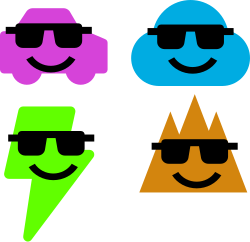

vvvv gamma 确实有很多丰富的内容，能力变强的同时，学习门槛也变高了，同时它还处于快速开发的阶段，很多文档，描述，使用场景也并不是很完备，这也使得充分理解也得耗费更长的时间。与其单打独斗成为我变秃了也变强了的超人，不如借助社区的力量，基于不同的方向将复杂的部分拆解开，每个成员都学习一点，彼此分享学到的知识，互通有无，岂不爽哉。

基于这个想法，我成立快乐（学习）小组，现在征集小组组员~ 无论你在何方，无论你有多少学习经验，只要能够花时间来学习vvvv gamma，并且愿意分享你的成果，都可以报名参加！

### 暂定小组活动：

- 线上基础入门workspace（为后续自学做准备）
- 每周五晚上的线上两个小时的学习分享会（争取将初级分享会与中级分享会错开，间隔举行，也保障有足够的学习时间，也不会给生活和学习带来太大压力）
- 不定期邀请嘉宾技术分享

### 报名与参与方式

- 在截至日期内扫码报名
- 在新的学习周期会拉一个微信群，到了活动日就在微信群中发布zoom链接加入，参与成员分享自己的学习成果
- 每周活动在获得组员的同意之后，通过视频或者文档的方式分享给其他社区的成员
- 两周的周期结束之后解散微信群并组建新的群

### 目前预计学习方向：

- VL语言特性
    - 基础
    - 面向对象化编程
    - 响应式编程
- 2D渲染
- 3D渲染
    - Stride基础
    - 底层渲染管线
- 流行库的学习
- 扩展学习
